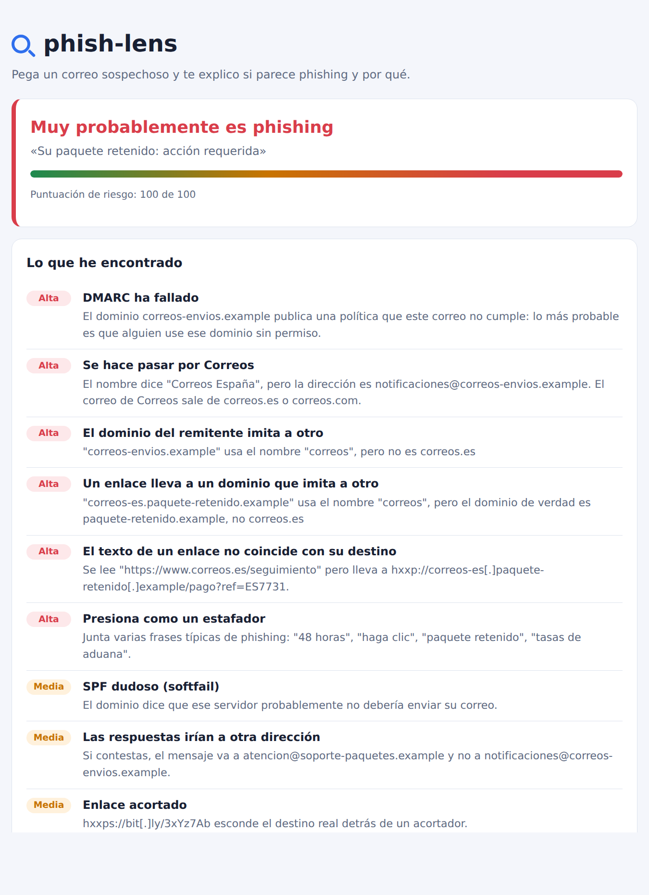

# phish-lens

[](https://github.com/espi0207/phish-lens/actions/workflows/ci.yml)

**Pruébalo aquí: https://espi0207.github.io/phish-lens/**

Una página web a la que le pasas un correo sospechoso (el archivo `.eml` o su código
fuente) y te dice si parece phishing y, sobre todo, **por qué**: quién lo envía de
verdad, si ha pasado SPF, DKIM y DMARC, si algún dominio imita a otro, si los enlaces
llevan a donde dicen y si los adjuntos esconden algo.

El correo **no sale de tu navegador**: no hay servidor, todo se analiza con JavaScript
en tu equipo. Es HTML, CSS y JavaScript sin librerías ni compilación.



## Instalarla como app

En Chrome o Edge sale el botón **Instalar como app** (o el icono de instalar en la barra
de direcciones). Queda en el menú de inicio o en Aplicaciones con su propia ventana,
funciona sin conexión y, en el ordenador, los correos `.eml` se pueden abrir con ella:
clic derecho sobre el archivo > *Abrir con* > phish-lens (la primera vez, Chrome pregunta
si la dejas abrir ese tipo de archivo).

En el móvil también se instala (en el iPhone, desde Safari: *Compartir > Añadir a
pantalla de inicio*), aunque ahí lo de abrir archivos no está: esa parte solo existe en
Chrome y Edge de ordenador.

## Ejemplos

Hay cuatro correos de ejemplo para probarlo sin tener uno a mano:

- [Paquete retenido](https://espi0207.github.io/phish-lens/#ejemplo=correos-paquete): el típico de "pague las tasas de aduana", con enlaces que dicen correos.es y llevan a otra parte.
- [Fraude del CEO](https://espi0207.github.io/phish-lens/#ejemplo=fraude-ceo): la "directora" pide una transferencia urgente desde un dominio casi igual al de la empresa. Pasa SPF, DKIM y DMARC, y aun así es una estafa.
- [Factura con adjunto](https://espi0207.github.io/phish-lens/#ejemplo=factura-adjunto): `Factura_2026-0917.pdf.html`, una página web disfrazada de PDF.
- [Correo legítimo](https://espi0207.github.io/phish-lens/#ejemplo=pedido-legitimo): para ver que no todo sale en rojo.

Están en `samples/` y todos los dominios son `.example`, que está reservado y no es de
nadie.

## Qué mira

**El remitente**

- Resultados de SPF, DKIM y DMARC (la cabecera `Authentication-Results` que pone tu
  proveedor al recibirlo; las de más abajo las puede escribir el propio atacante).
- Que el nombre visible no sea otra dirección (`"soporte@paypal.com" <x@otro.com>`)
  ni una marca conocida que no corresponde con el dominio (`"Correos España" <...@correos-envios.example>`).
- Que las respuestas no vayan a otra dirección, sobre todo a un correo gratuito.

**Dominios que imitan a otros**, en el remitente y en los enlaces:

- Letras de otros alfabetos: `pаypal.com` con una "а" cirílica. El navegador lo
  convierte en `xn--pypal-4ve.com` y la página lo vuelve a enseñar como lo vería la
  víctima.
- Trucos de siempre: `paypa1`, `arnazon` (rn por m), `gooogle`.
- La marca metida en un dominio que no es suyo: `paypal.com.cuenta-segura.example`.
- Dominios casi iguales al de **tu propia empresa**, que es como funciona el fraude del
  CEO: se compara con los dominios de los destinatarios.

**Enlaces**: texto que dice una web y lleva a otra, el truco de la `@`
(`https://www.bbva.es@otro-sitio.example`), IPs en vez de dominios, acortadores y enlaces
`javascript:`. Se enseñan "desactivados" (`hxxps://ejemplo[.]com`) para no abrirlos
sin querer.

**Adjuntos**: ejecutables, scripts, páginas web (`.html`, `.svg`), documentos con macros,
imágenes de disco (`.iso`, `.img`), dobles extensiones (`factura.pdf.exe`) y nombres
dados la vuelta con el carácter U+202E.

**El texto**: frases de manual ("48 horas", "no puedo hablar", "es confidencial",
"verifique su cuenta"...). Una sola no dice nada; tres juntas, bastante.

Cada cosa suma puntos según su gravedad y con eso sale el veredicto. Ninguna comprobación
decide sola.

## Cómo sacar un correo

- **Gmail**: abre el correo, menú ⋮, *Descargar mensaje* (o *Mostrar original* para copiarlo).
- **Outlook en la web**: menú …, *Ver*, *Ver origen del mensaje*.
- **Thunderbird**: `Ctrl+U`, o *Archivo > Guardar como*.
- **Mail de Apple**: *Visualización > Mensaje > Código fuente original*.

Hace falta el correo entero, con las cabeceras: solo el texto no basta.

## Cómo funciona

```text
js/
├── mail.js      parser de .eml: cabeceras, RFC 2047, parámetros RFC 2231, MIME, base64 y quoted-printable
├── links.js     enlaces del HTML, sin llegar a interpretarlo
├── domains.js   punycode (RFC 3492), dominios parecidos, marcas
├── analyze.js   las comprobaciones y la puntuación
└── app.js       la página
```

Algunas decisiones:

- **El HTML del correo no se muestra nunca.** Los enlaces se sacan con expresiones
  regulares y todo lo que se pinta va con `textContent`. Hay una prueba que falla si
  alguien usa `innerHTML` o parecidos en el proyecto. Además la página lleva una
  Content-Security-Policy que no deja cargar scripts de fuera, enviar formularios ni
  conectarse a otros sitios.
- **El parser trabaja sobre bytes.** Un correo puede mezclar UTF-8, ISO-8859-1 y
  Windows-1252 en distintas partes. Se guarda todo como bytes y cada parte se
  descodifica con su juego de caracteres al final; si no, las tildes salen rotas.
- **Punycode hecho a mano.** El navegador convierte los dominios internacionales a
  punycode, pero no trae nada para deshacerlo. Las pruebas usan vectores sacados del
  códec de Python.
- **Dominios "parecidos".** Cada dominio se reduce a un "esqueleto" (cirílico y griego a
  latino, `0` a `o`, `rn` a `m`...) y se compara con el de las marcas y con el de los
  destinatarios. Para errores de una letra se usa la distancia de Levenshtein, con una
  lista de excepciones para palabras normales ("finance" no intenta parecer "binance").

## Limitaciones

- No comprueba las firmas DKIM ni consulta SPF por su cuenta: haría falta preguntar al
  DNS, y la idea es que nada salga del navegador. Se fía de lo que puso tu proveedor.
- No mira dentro de los comprimidos ni analiza los adjuntos.
- No consulta listas negras de dominios o URLs, por lo mismo: sería enviar datos fuera.
- La lista de marcas es corta (bancos, paquetería y servicios que más se suplantan en
  España) y el "dominio registrado" es una aproximación sin la Public Suffix List.
- Que no salga nada no quiere decir que el correo sea seguro. Un correo bien hecho desde
  una cuenta robada puede pasar todas estas comprobaciones.

## Desarrollo

No hay nada que instalar. Para abrirlo en local hace falta un servidor (los módulos de
JavaScript no funcionan abriendo el archivo con doble clic):

```bash
python3 -m http.server 8000     # y abrir http://localhost:8000
```

Las pruebas usan el runner que trae Node (20 o superior):

```bash
npm test
```

Para publicarlo en GitHub Pages: *Settings > Pages > Deploy from a branch*, rama
`main` y carpeta `/ (root)`.

Lo que la hace instalable son tres archivos: `manifest.webmanifest` (nombre, iconos y
`file_handlers`, que es lo que la pone en *Abrir con* para los `.eml`), `sw.js` (guarda
la página para usarla sin conexión) y los iconos de `icons/`. Si se añade un archivo a
la página, hay que meterlo en la lista de `sw.js`; hay una prueba que lo vigila.

## Licencia

[MIT](LICENSE)
